# Monitor ArgoCD - Opción 1

Este proyecto implementa un sistema de monitoreo para aplicaciones gestionadas con ArgoCD. Incluye un script en Python que interactúa con el cliente de ArgoCD y envía notificaciones a Slack, además de un pipeline CI/CD configurado con GitHub Actions.

---

## **Estructura del Proyecto**

```plaintext
.
├── .github/
│   └── workflows/
│       └── CD.yml          # Workflow de GitHub Actions para CI/CD
├── Docker/
│   ├── .env                # Variables de entorno sensibles
│   ├── Dockerfile          # Imagen Docker para ejecutar el script
│   ├── monitor_argocd.py   # Script principal en Python
│   ├── requirements.txt    # Dependencias de Python
├── templates/
│   ├── _helpers.tpl        # Helpers para Helm
│   ├── cronjob.yaml        # Configuración de CronJob
│   ├── serviceaccount.yaml # Configuración de ServiceAccount
├── argocd-application.yaml # Configuración de la aplicación en ArgoCD
├── Chart.yaml              # Configuración del Chart de Helm
├── values.yaml             # Valores de configuración de Helm
└── .helmignore             # Ignorar archivos en Helm

Requisitos
Docker: Para construir y ejecutar la imagen del contenedor.
Python 3.9+: Para ejecutar el script localmente.
ArgoCD: Para gestionar las aplicaciones.
Slack Webhook: Para recibir notificaciones.

Configuración
1. Variables de Entorno
Configura las variables de entorno en el archivo Docker/.env:

```plaintext
SLACK_WEBHOOK_URL=<tu_webhook_de_slack>
ARGOCD_USERNAME=<tu_usuario_argocd>
ARGOCD_PASSWORD=<tu_contraseña_argocd>
```

2. Construcción y Ejecución
Construir la Imagen Docker

```plaintext
docker build -t monitor-argocd:latest Docker/
```

Ejecutar el Contenedor
```plaintext
docker run --env-file [.env](http://_vscodecontentref_/1) monitor-argocd:latest
```

Pipeline CI/CD
El pipeline CI/CD está configurado en CD.yml y realiza las siguientes tareas:

Construcción de la Imagen Docker: Construye y publica la imagen en Docker Hub.
Actualización de values.yaml: Actualiza el tag de la imagen en el archivo de configuración de Helm.
Sincronización con ArgoCD: Sincroniza automáticamente los cambios con ArgoCD.

```mermaid
graph TD
    A[Desarrollador] -->|Push a GitHub| B[GitHub Actions]
    B -->|Construcción de Imagen| C[Docker Hub]
    B -->|Actualización de values.yaml| D[Repositorio Git]
    D -->|Sincronización Automática| E[ArgoCD]
    E -->|Despliegue| F[Cluster Kubernetes]
    F -->|Estado de la Aplicación| G[Monitor ArgoCD]
    G -->|Notificación| H[Slack]
```



Contribución
Haz un fork del repositorio.
Crea una rama para tu feature:

```plaintext
git checkout -b feature/nueva-funcionalidad
```

Realiza tus cambios y haz un commit:
git commit -m "Añadir nueva funcionalidad"

Haz un push a tu rama:
git push origin feature/nueva-funcionalidad

Abre un Pull Request.

Licencia
Este proyecto está licenciado bajo la MIT License.

---

### **Notas**

- **Diagrama**: El diagrama en formato `mermaid` será renderizado automáticamente en plataformas como GitHub.
- **Seguridad**: Asegúrate de que el archivo [.env](http://_vscodecontentref_/2) no esté versionado y utiliza GitHub Secrets para manejar información sensible en el pipeline.
- **Personalización**: Ajusta las secciones del `README.md` según las necesidades específicas de tu proyecto.

Si necesitas más ayuda, no dudes en pedírmelo. 😊

